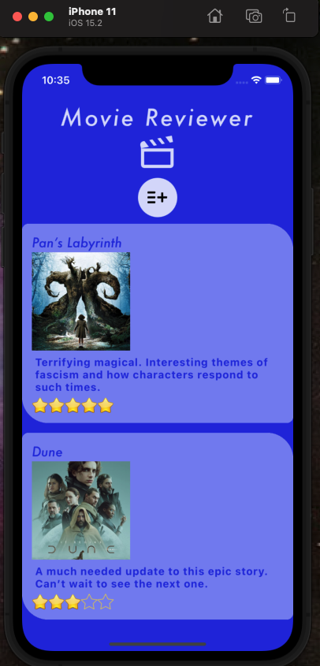

# Movie Reviewer

User can create, read, update and delete movie reviews on a mobile application.

Live Site: https://expo.dev/@katiepestotnik/movie-reviewer

Technologies:
- React Native
- Styled Components
- Expo Go
- XCode iOS simulator
- Android Studio Android emulator
- JavaScript
- Backend API
    - https://github.com/katiepestotnik/reviewer-backend

Able to make this app from the following sources:

- Simple todo app tutorial:  https://www.youtube.com/watch?v=0c0v_40MPq8
- More complex app tutorial:  https://codewithmosh.com/p/the-ultimate-react-native-course
- Star Rating:  https://aboutreact.com/react-native-custom-star-rating-bar/
- Form Hook: (couldn't get formik to work)  https://react-hook-form.com/get-started/#ReactNative

Added Dependencies(expo install):
- styled-components
- expo-constants
- react-native-swipe-list-view
(npm install):
- react-hook-form

iOS and Android 

Icons 
- 1024X1024  

Splash Screen 
- 1242X2436

Future Improvements:
- Refresh function
- Edit to include prefilled fields of current data

remote instead of origin

https://blog.waldo.io/add-an-image-picker-react-native-app/
https://reactnavigation.org/docs/getting-started/